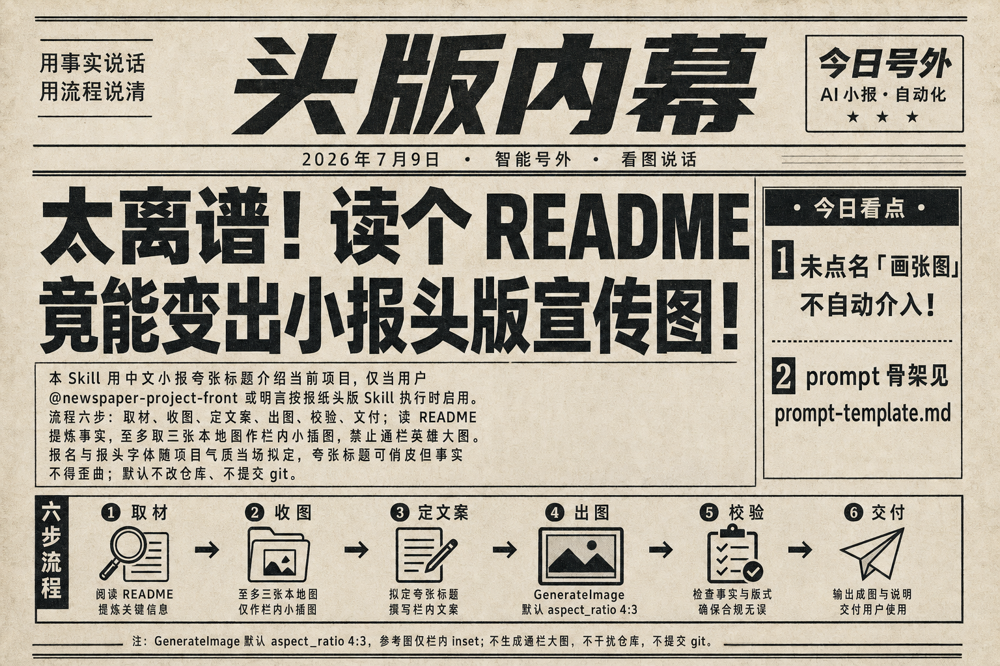

# newspaper-project-front · 项目小报头版

[← 返回总览](../../../README.md)



---

## 概览

| 项 | 值 |
|----|-----|
| **Skill 文件** | [SKILL.md](SKILL.md) |
| **Prompt 模板** | [prompt-template.md](prompt-template.md) |
| **标识** | `newspaper-project-front` |
| **触发方式** | `@newspaper-project-front`、或明言「按报纸头版 Skill 介绍项目」 |
| **自动启用** | 否（`disable-model-invocation: true`） |

用中文小报头版的夸张标题，生成一张**介绍当前项目**的宣传图。仅在用户**显式点名**本 skill 时执行。

---

## 工作流程

```
1. 取材  → 读项目 README，提炼卖点、机制与限制
2. 收图  → 从 README 取本地图（至多 3 张），作栏内小插图
3. 定文案 → 中文小报语气；报名与报头字体随项目气质拟定
4. 出图  → 调用 GenerateImage（默认横版 4:3；prompt 说「竖版」则用 3:4）
5. 校验  → 核对标题可读性、事实准确性、配图布局
6. 交付  → 对话展示成图并简述
```

---

## 核心规则

- **取材**：读当前项目 `README.md`（或指定文档）；**勿捏造**文档未载之参数。
- **收图**：优先产品截图、架构图、演示结果；排除徽章、favicon、纯 logo；无图则仅用示意或流程条。
- **定文案**：夸张标题可俏皮，**事实不得歪曲**；报名 4–8 字，随项目领域变化，**无全局默认**。
- **出图**：参考图仅作栏内小插图，**禁止**通栏英雄大图；须另有示意或底部流程条。
- **版式**：默认横版 `4:3`；在 prompt 中说「竖版」「纵向」「竖屏」等则出竖版 `3:4`，正文栏自上而下叠放。
- **交付**：默认不改仓库代码、不提交 git、不把图写入仓库，除非另行要求。

---

## 如何启用

```
@JS_skills/.cursor/skills/newspaper-project-front/SKILL.md
```

或简写：

```
@newspaper-project-front
```

---

[← 返回总览](../../../README.md) · [查看 SKILL.md 全文 →](SKILL.md) · [Prompt 模板 →](prompt-template.md)
